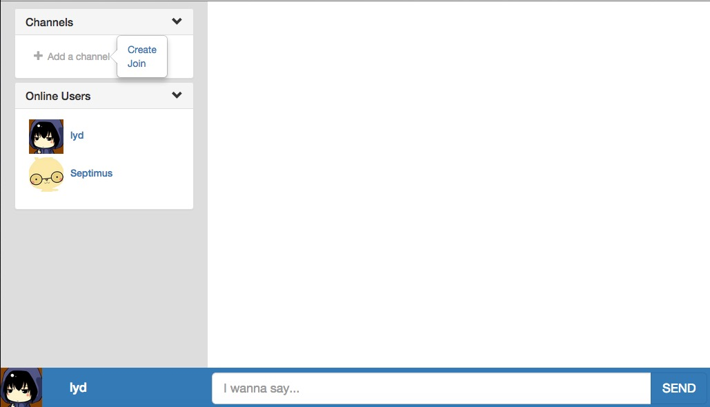

# talkin

一个web端的实时聊天系统，采用Nodejs express + angular + bootstrap搭建，可在局域网内建立内部实时聊天服务。

## 更新

### 0.1.0更新

- 添加@功能。现在可以在聊天框中输入@，并可以从当前在线用户列表中选择@用户。被@的用户将在界面右上角收到推送消息。

## 主要功能

1. 自定义昵称和选择头像
2. 创建频道和订阅频道
3. 在不同的频道发送消息，并接收订阅频道的消息
4. 撤回自己发送的消息
5. 获取在线用户列表
6. 在频道聊天中@用户

## 构建 & 运行

1. 下载代码
2. 执行`bower install`
3. 执行`npm install`
4. 执行`grunt`

## 界面

## 后续计划

计划加入markdown编辑器以及私信聊天等。
