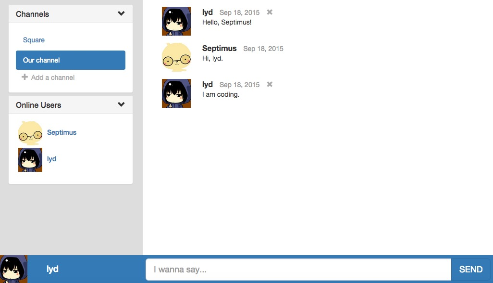

# talkin

一个web端的实时聊天系统，采用Nodejs express + angular + bootstrap搭建，可在局域网内建立内部实时聊天服务。

## 主要功能

1. 自定义昵称和选择头像
2. 创建频道和订阅频道
3. 在不同的频道发送消息，并接收订阅频道的消息
4. 撤回自己发送的消息
5. 获取在线用户列表

## 构建 & 运行

1. 下载代码
2. 执行`bower install`
3. 执行`npm install`
4. 执行`grunt`

## 界面

## 后续计划

@功能开发了一部分，另外计划加入markdown编辑器以及私信聊天等。
